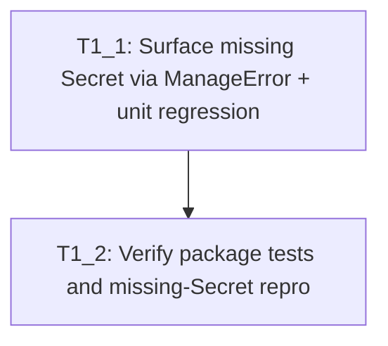

# Execution Backlog
**Bug:** OCPBUGS-63242 — MustGather CR stuck when caseManagementAccountSecretRef points to a missing Secret
**AgentRoutingMode:** PROVIDED
**ConstitutionVersion:** 1.0.0

**task_sizing:** `{ min: 2, max: 2, consolidation_threshold: 2 }` applied after decomposition (user chose defaults 2–8; consolidated to 2 tasks)
**SME defaults:** ManageError · NotFound only · unit-only

## 0. Input coverage checklist

- RCA: Secret NotFound returns `reconcile.Result{}, nil` without status → **T1_1**
- RCA: Job never created / empty MustGather status → **T1_1**, verified by **T1_2**
- RCA: Existing test encodes silent success → **T1_1** (co-generated test update)
- Plan: Use `ManageError` for user-visible failure → **T1_1**
- Plan: NotFound-only scope (no change to other Secret Get errors) → **T1_1** Non-goals
- Plan: Unit-only regression (no e2e task) → **T1_1** Acceptance criteria; no separate e2e task
- Plan files: `mustgather_controller.go` + `mustgather_controller_test.go` → **T1_1**
- Repro confirmation after fix → **T1_2**

## 1. Task Dependency Graph (Mermaid)

## 2. Linear Execution Order (Chronological)

1. [x] T1_1 — Surface missing Secret via ManageError + unit regression
2. [x] T1_2 — Verify package tests and missing-Secret repro

## 3. Task Execution Manifest (table)

| Task ID | Task Title | Assigned Agent | Depends On | Parallel OK | Complexity | Risk |
|---------|-----------|---------------|-----------|------------|-----------|------|
| T1_1 | Surface missing Secret via ManageError + unit regression | OperatorController_Agent | none | No | 3 | Med |
| T1_2 | Verify package tests and missing-Secret repro | Testing_Agent | T1_1 | No | 2 | Low |

## 4. Task Specifications (Payloads)

### Task T1_1: Surface missing Secret via ManageError + unit regression
- **Objective:** When `caseManagementAccountSecretRef` Secret is NotFound before Job create, surface a durable user-visible MustGather error via `ManageError` (do not return empty success), keep Job uncreated, and update unit tests to assert that contract.
- **Root cause trace:** rca-report.md §4 — NotFound branch `return reconcile.Result{}, nil` at `mustgather_controller.go` ~L178–180 without status update.
- **Target file(s):**
  - `controllers/mustgather/mustgather_controller.go`
  - `controllers/mustgather/mustgather_controller_test.go`
- **Non-goals / forbidden edits:**
  - Do not change Job template / upload script / CRD schema
  - Do not alter non-NotFound Secret Get requeue path unless required for compile
  - Do not add e2e tests
  - Do not copy post-`0ff4e00` fix commits as the solution source
  - Do not hand-edit generated `zz_generated.*` files
- **Implementation notes:**
  - Follow existing in-file `ManageError` call sites for error surfacing
  - Preserve skip of Job creation when Secret is missing
  - Replace/update `reconcile_job_not_found_user_secret_missing_no_requeue` (or equivalent) so it asserts no Job **and** failed/error status (or condition) indicating Secret not found
  - Keep happy-path create-with-secret tests passing
- **Acceptance criteria:**
  - Missing Secret path no longer returns silent empty success without status update
  - No Job created for missing Secret case
  - MustGather exposes user-visible failure (status/condition/reason via ManageError path)
  - Unit tests co-generated/updated and pass: `go test ./controllers/mustgather/ -count=1`
  - Traces to rca-report.md §6 and bugfix-plan.md §2–§4
- **Downstream handoff:** Controller + test files ready for T1_2 verification; behavior contract frozen (ManageError on NotFound; NotFound-only scope)

### Task T1_2: Verify package tests and missing-Secret repro
- **Objective:** Confirm the fix with package tests and the missing-Secret repro scenario from repro-verification-report.md (no Job + user-visible status error).
- **Root cause trace:** rca-report.md / repro-verification-report.md failure signature must no longer hold after T1_1.
- **Target file(s):** none (verification only; may read T1_1 outputs)
- **Non-goals / forbidden edits:** No product code changes unless verification fails (then re-open T1_1)
- **Implementation notes:**
  - Run controller package tests
  - Re-check missing-Secret reconcile scenario expectations from approved repro report
- **Acceptance criteria:**
  - `go test ./controllers/mustgather/ -count=1` passes
  - Prefer also `make go-test` when environment allows
  - Missing-Secret scenario: no Job; MustGather status/error surfaced (not empty)
  - Happy-path tests still pass
- **Downstream handoff:** Verification results for `/opsx-apply` completion / implementation-report

## 5. Orchestration notes (non-code)

### Retry Boundaries
- T1_1 may retry until unit tests for missing Secret + package suite pass
- T1_2 retries safely (read-only verification); on failure, return to T1_1

### Merge Conflict Hotspots
- `controllers/mustgather/mustgather_controller.go` (Secret lookup block)
- `controllers/mustgather/mustgather_controller_test.go` (missing-secret case)
- Avoid editing `zz_generated.*`, vendor, or CRD YAML for this change

### Open Questions Requiring SME Before Execution
- None — SME defaults applied: ManageError · NotFound only · unit-only · task range defaults consolidated to 2 tasks
